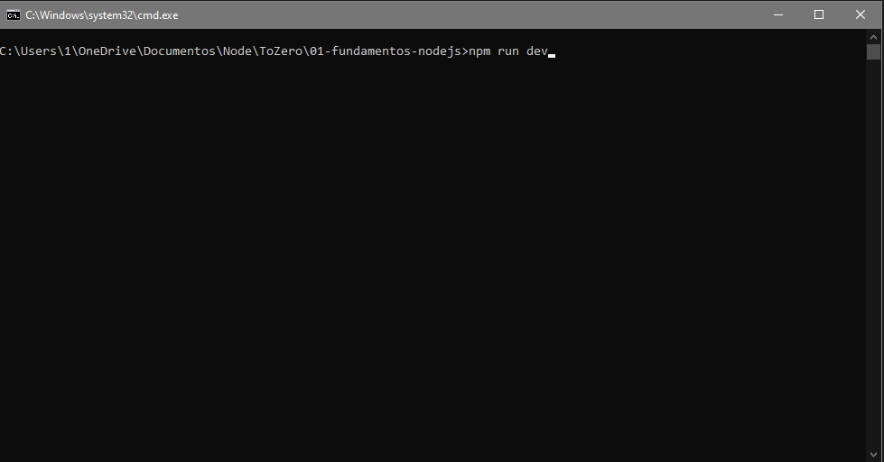
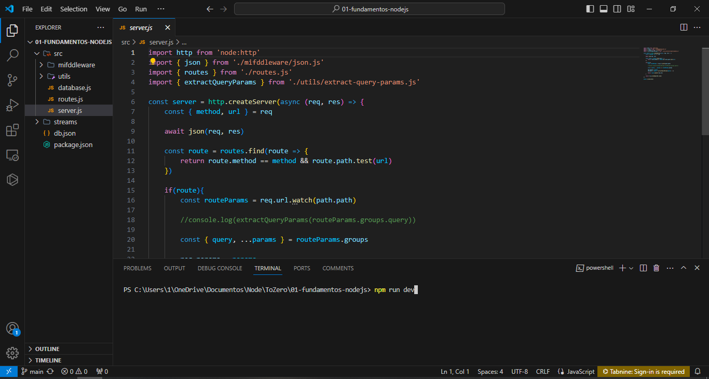

# ToZero
 
## How to use this code

1. Save project folder in your Machine and <a href="https://nodejs.org/en/download/current"> download NodeJS</a>

2. Use an IDE at the your preference, but I recommended <a href="https://code.visualstudio.com/download">VS Code</a>

3. Open folder project with your Terminal or VS Code and enter <code>npm run dev</code>  

## Examples to execute
On Windows terminal

On VSCode

